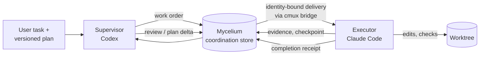

# SporeDrive

SporeDrive is local workflow infrastructure for **supervised coding with Codex and Claude Code**.
One session supervises, and one executor session is the only writer of a repository worktree. The
single writer is a workflow policy backed by each host's own permissions; SporeDrive does not
enforce it at the filesystem level. The
two coordinate through a durable record on disk rather than through copy-paste between chat windows.

It is aimed at people who already run both Codex and Claude Code on a Mac and want long or
multi-step work to be:

- **bounded**: the number of dispatches and reviews has a limit;
- **addressable**: a message reaches one specific session;
- **resumable**: the task survives compaction and restarts;
- **auditable**: "done" means evidence was checked, not merely claimed.

SporeDrive coordinates the models; it does not make them reason better. It makes no promise of
cost savings or reliability.

## The problem it addresses

Supervising one agent with another usually fails in a few predictable ways:

- instructions typed into the wrong window;
- a supervisor that quietly starts editing too;
- context lost at compaction;
- review loops that never end;
- "done" reported without evidence.

SporeDrive answers each of these with a small, explicit mechanism:

- a single-writer role split;
- a persisted, addressed message store;
- delivery bound to one native session identity;
- per-task allowances enforced in code for managed tasks;
- completion receipts that are verified against artifact hashes.

## How a piece of work flows



1. The user gives a task. For substantial work, it comes with a versioned plan.
2. The supervisor writes a **work order**: scope, fixed checks and the evidence required.
3. The work order is **stored** as an addressed coordination message.
4. The supervisor **delivers** it through the cmux bridge. The bridge types into the one session
   that matches the bound workspace, worktree, session id and controller.
5. The executor does the work, runs the checks, and reports **evidence** and **checkpoints**.
6. At milestones, the supervisor reviews and relays a plan delta or repair order. Each review and
   repair is drawn from a fixed allowance.
7. The executor sends a **completion receipt** naming artifacts and their sha256.
   - A matching hash verifies the evidence's identity only.
   - The task closes only when its frozen required checks and criteria have passed and been
     accepted.

Five states are kept separate on purpose:

| State | What it means |
|---|---|
| Stored | The message is persisted in the store. It wakes nobody. |
| Submitted | The bridge typed it into the bound terminal session. |
| Accepted | The native host actually took it as input. |
| Evidence verified | A receipt's artifacts matched their recorded hashes. This proves which files were submitted. |
| Accepted complete | The frozen required checks and criteria passed and were accepted, so the task can close. |

A stored message does not wake an idle session. There is no background dispatcher, daemon or
scheduler.

## Components

| Component | Where | What it does |
|---|---|---|
| Instruction and skill policy | `src/claude/`, `src/codex/` | Global instruction files (`CLAUDE.md`, `AGENTS.md`), the Claude `codex-review` skill and `codex_ask` reviewer wrapper, and the Codex `cmux-driver` skill (driver protocol, runbook, plan template). |
| Mycelium coordination | `coordination/mycelium_coord/` | Store for tasks, messages, checkpoints and execution allowances. Exposed as a CLI (`coordination/bin/mycelium-coord`) and `coord_*` / `execution_*` MCP tools. |
| cmux bridge | `bridge/cmux_bridge/` | A `codex-claude-bridge` MCP server. It binds to one Claude session in the cmux terminal app, then submits notifications into it. Before each Enter keypress it re-checks the task's pause and closure gate. |
| Lifecycle hooks | `mycelium-source/` plus `core-overlay/` | Bundled Mycelium plugin source. Its SessionStart, PostToolUse and Stop hooks keep optional "living repository" bookkeeping (`.living/` logs, learnings, handoffs). |
| Installer and exporter | `scripts/wfctl.py`, `scripts/export_coordination.py` | `wfctl` installs the global instruction files and skills, with snapshots and rollback. The exporter builds one integrated plugin from the bundled sources. |

State is split between your machine and the model services:

- **On your machine:** the coordination store (a directory chosen by `--root` or
  `MYCELIUM_COORD_DIR`), install snapshots, and each project's `.living/` and `.mycelium/`
  bookkeeping.
- **External:** only model inference, by the Codex and Claude Code services you already use.

Three layers are independent:

- **The coordination protocol** (messages, checkpoints, allowances) works with or without the
  lifecycle hooks.
- **Living-repository bookkeeping** applies only to projects you initialize.
- **Host activation** (plugin install, hook trust, restarts) decides what a fresh session actually
  loads.

## Role policy (project defaults)

The shipped instruction files configure these roles. They are this project's choices, not vendor
recommendations:

- **Substantial work:**
  - An Astra XHigh session and a dedicated Fable 5.1 planner produce a versioned plan.
  - A Sol 6 Medium session drives a dedicated Opus 5.5 executor through cmux.
  - At milestones backed by evidence, the driver asks for both an Astra correctness audit and
    Fable plan feedback, then relays one reconciled work order.
- **Fable is planning-only.** Implementation sessions start with an explicitly chosen model. The
  bridge refuses to bind implementation work to a Fable or default-model session
  (`bridge/cmux_bridge/model_policy.py`).
- **Routine, narrow work** needs no panel. It gets one scoped review and one verification of its
  repairs.

The limits of this policy:

- **Model availability:** these are role names in the instruction files. Check which models your
  installed Codex and Claude Code versions and accounts actually offer, and edit
  `src/` to match before installing.
- **Enforcement:** nothing here schedules reviewers automatically. The allowance machinery only
  refuses work beyond a task's limits.

Full contracts:
[implementation-plan template](src/codex/skills/cmux-driver/references/implementation-plan.md) and
[driver protocol](src/codex/skills/cmux-driver/references/driver-protocol.md).

## Example: one milestone

After setup, a user might hand the supervisor something like this:

```text
Task: add CSV export to the report CLI (plan v1.0, repo ~/src/reportkit).
Milestone 1 — export command
  Outcome:  `reportkit export --csv out.csv` writes all rows with a header.
  Checks:   pytest tests/test_export.py passes; ruff clean on changed files.
  Evidence: test log path, diff stat, sample out.csv with sha256.
  Hold:     do not start milestone 2 (streaming) until milestone 1 is reviewed.
Limits: one scoped review, one repair, deadline 17:00 Eastern.
Please open a managed task, launch an Opus executor in cmux, and send this as the work order.
```

The supervisor then does the following:

1. Opens a managed task with those limits.
2. Stores and delivers the work order to the bound executor.
3. Waits for evidence, and reviews once.
4. Relays at most one repair.
5. Checks that the receipt's files hash-match. It accepts completion only once the milestone's
   required checks have passed.

For a runnable, command-level walk-through of the underlying messages, see
[docs/operations.md](docs/operations.md#minimal-message-exchange).

## Prerequisites and platform

- macOS, with the cmux terminal app. The bridge needs cmux socket access, in
  either `cmuxOnly` ancestry or password socket-control mode.
- Current `codex` and `claude` CLIs, logged in.
- Python 3.13 (the tested interpreter) with `fastmcp` and `mcp` installed on the interpreter that
  runs the two MCP servers. For tested versions, see
  [docs/installation.md](docs/installation.md#tested-versions).
- Everything runs on one machine. The store is a local directory, not a network service.

## Setup in outline

Cloning installs nothing. Setup is four distinct steps; details and exact commands are in
**[docs/installation.md](docs/installation.md)**.

1. **Review and customize `src/`.** Then run `python3 scripts/wfctl.py install`. This *replaces*
   the managed global files under `~/.claude` and `~/.codex`, after snapshotting them.
   - `wfctl.py verify` reports drift.
   - `wfctl.py rollback <label>` restores a snapshot, and it supports `--dry-run`.
   - `install` itself has no dry-run mode.
2. **Export the integrated plugin.** Run
   `python3 scripts/export_coordination.py --source mycelium-source --target <dir>`.
   Always pass `--source` explicitly.
3. **Activate it on each host** from the local export directory:
   - Claude: install the plugin from the local marketplace.
   - Codex: install the plugin, then trust all seven hook registrations in `/hooks`.
   - Restart, because only fresh sessions load the new build.
   - Register the cmux bridge separately for Codex.
4. **Initialize each target repository** as a Mycelium project. On Claude Code, this is what
   registers the lifecycle hooks for that repository.

## Limits and maturity

This is a working personal toolchain published as-is. It is not a production service.

- **What is enforced, and what relies on trust.** Allowances, reservations, and pause, expiry and
  closure gates are enforced in code for *managed* tasks.
  - Whether a message is actionable is a disposition the sending agent declares honestly.
  - Unmanaged messaging is not gated.
  - File and shell access still depend on each host's own permission settings.
- **No overall model, token or cost cap.** SporeDrive limits dispatches, reviews and the reviewer's
  wall-clock time. It does not cap what a session spends while reasoning.
- **Same machine only.** Sessions share a local store directory.
- **No unattended operation.** There is no scheduler. A stored message does not wake an idle
  session.
  - Waking an idle Codex desktop session is experimental and reports `not_established`.
- **The installed build must be exact.** Installing or re-exporting affects only fresh sessions.
  Check what a session actually loaded before trusting it; see the health checks in
  [docs/installation.md](docs/installation.md#health-checks).

## Repository map

```
src/claude/, src/codex/     instruction files and skills installed by wfctl
coordination/               mycelium_coord package, CLI launcher, coordination skill
bridge/                     cmux_bridge MCP server and its offline tests
mycelium-source/            bundled Mycelium lifecycle plugin source (pinned; own LICENSE)
core-overlay/               repo-owned hook files that replace source hooks at export
scripts/                    wfctl.py, export_coordination.py, smoke_check.sh, export tests
tests/                      installer tests
docs/                       installation and operations guides
PROVENANCE.md, VERSION      source provenance and the instruction-contract version
```

## Contributing and offline checks

All of these run offline, with no cmux, network or model calls:

```bash
python3 -m pytest tests -q                                   # installer
( cd bridge && python3 -m pytest tests -q )                  # bridge
( cd coordination && python3 -m pytest tests -q )            # coordination package
python3 -m pytest -q scripts/test_export_coordination_hooks.py scripts/test_export_stop_budget.py
```

Two other checks touch real sessions and are not routine tests:

- `scripts/smoke_check.sh` runs fresh `claude -p` and `codex exec` instruction smokes, so it makes
  model calls.
- The live bridge acceptance run (`bridge/run_live.sh`) needs a real cmux session and a disposable
  directory.

Run both only deliberately.

## Provenance and license

- **MIT:** the SporeDrive-authored parts (`src/`, `coordination/`, `bridge/`, `scripts/`, `tests/`,
  docs) are MIT-licensed; see [LICENSE](LICENSE).
- **Derived from Mycelium:** `core-overlay/` holds modified copies of Mycelium hook files, which
  remain under Mycelium's own license.
- **Upstream Mycelium:** `mycelium-source/` is Mycelium lifecycle source pinned at commit
  `f2b0083`. It carries its own upstream `LICENSE` (MIT, Mycelium Contributors) and `README.md`.
- **History:** [PROVENANCE.md](PROVENANCE.md) records what was included or excluded and why.

## Further reading

- [docs/installation.md](docs/installation.md): install, export, activation, health checks, bridge
  setup, rollback.
- [docs/operations.md](docs/operations.md): bounded execution, waiting, owner follow-up, messaging
  example, troubleshooting.
- [cmux runbook](src/codex/skills/cmux-driver/references/cmux-runbook.md) and
  [bridge MCP contract](src/codex/skills/cmux-driver/references/bridge-mcp.md).
- [Mycelium coordination reference](src/codex/skills/cmux-driver/references/mycelium-coordination.md)
  and [coordination skill](coordination/skill/SKILL.md).
