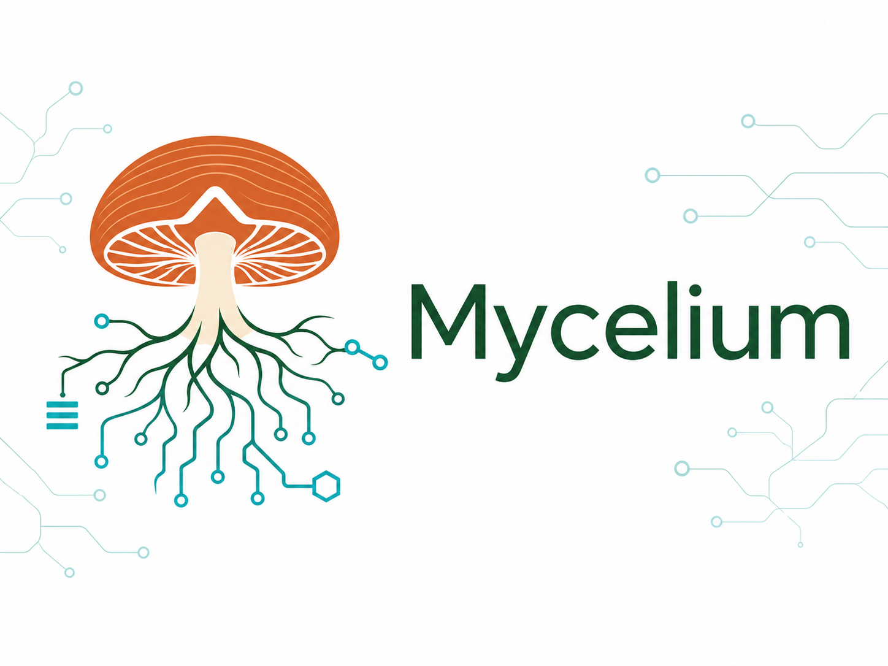

<p align="center">
  
</p>

<!-- Badges -->
[](LICENSE)
[](.github/workflows/validate-skill.yml)

**A self-documenting, self-improving framework for analytical projects.**

Most analytical work disappears. You spend weeks figuring out the right normalization for a tricky dataset, discover that a particular clustering method fails silently on sparse data, or learn that a specific file format needs a workaround — and none of that knowledge is captured anywhere durable. The next person (or you, six months later) starts from scratch.

Mycelium changes this. It gives every analytical project a memory — a structured layer that records decisions, captures hard-won insights, and tracks what was done and why. Install the Mycelium plugin in Claude Code or Codex, point it at any project, and it scaffolds a living analytical framework. Every analysis, dataset, and decision is registered. Learnings accumulate. Domain-specific best practices flow in from the network.

**The bigger vision:** analytical projects shouldn't be isolated silos. A lab that works on RNA-seq, image analysis, and spatial transcriptomics is generating overlapping knowledge across all of those efforts — but that knowledge stays trapped in individual folders and the heads of the people who did the work. Mycelium is building toward a world where projects are nodes in a knowledge network: insights discovered in one project flow automatically to others that need them, domain expertise is packaged and shared, and the collective intelligence of a research group compounds over time instead of evaporating.

## Philosophy

Mycelium is named after the underground fungal networks that connect trees in a forest — sharing nutrients, signaling danger, and building collective resilience. Similarly, mycelium-enabled projects are nodes in a knowledge network:

- **Each project carries its own memory.** Decisions, learnings, and conventions are recorded as structured traces in the `.living/` directory, so every session starts with the accumulated intelligence of all previous sessions.
- **Projects grow smarter over time.** Gotchas encountered once are never forgotten. Patterns detected in learnings crystallize into conventions. The project evolves.
- **The network shares nutrients.** Domain-specific best practices (bioinformatics, image analysis, and more) are packaged as convention packs that any project can install. When one project discovers something generally useful, it can contribute back.

## Mycelium in practice

<p align="center">
  
</p>

<em>Mycelium ingests research output, crystallizes it into structured learnings, decisions, and findings, and re-surfaces it to inform downstream work via the mycelial network. Knowledge that would otherwise evaporate between sessions compounds across them.</em>

## Quickstart

### 1. Install the plugin

**Claude Code:**

```bash
# Add the mycelium marketplace (one-time)
claude plugin marketplace add arjunrajlaboratory/mycelium

# Install the plugin
claude plugin install mycelium@mycelium
```

This permanently registers the mycelium plugin with your Claude Code
installation. Its shared skills—including the analysis, reporting, review,
development, and lifecycle-audit workflows—become available as namespaced slash
commands in all sessions.

**Codex:**

```bash
codex plugin marketplace add arjunrajlaboratory/mycelium
codex plugin add mycelium@mycelium
```

Start a new task after installation. Codex can invoke the bundled skills
implicitly, through the plugin picker, or explicitly by skill name.

Before the first Mycelium task, launch a current Codex CLI, open `/hooks`, and
trust all five Mycelium plugin hooks. `/hooks` is a CLI command, not a Codex
desktop-app slash command; if the CLI does not list it, run `codex update` and
relaunch the CLI. Fully exit Codex afterward and restart it so the approved
`SessionStart` hook is present from process startup. The hooks are bundled with
the plugin and resolve through Codex's dynamic `PLUGIN_ROOT`; they do not embed
a versioned cache path into your repositories.

**Local Claude development install:**

```bash
git clone https://github.com/arjunrajlaboratory/mycelium.git
claude --plugin-dir /path/to/mycelium
```

Replace `/path/to/mycelium` with the actual path where you cloned it. This loads the plugin for a single session only.

### 2. Initialize your project

Open Claude Code or Codex in any project directory and say:

> "Set up mycelium" or "Initialize living repo"

This scaffolds the living repository structure, manifests, the `.living/`
memory layer, canonical `MYCELIUM.md` guidance, and thin `CLAUDE.md` and
`AGENTS.md` adapters. **Core convention packs** (`robust-analysis`,
`report-generator`, and `idea-generator`) are installed automatically.

**Codex hook approval:** if you did not approve the plugin hooks during
installation, open `/hooks` in a current Codex CLI—not the desktop app—and trust
all five Mycelium command hooks. If `/hooks` is absent, run `codex update` and
relaunch the CLI. Fully exit Codex and restart it before opening the initialized
project. Codex deliberately skips untrusted command hooks. Revisit `/hooks`
after plugin upgrades: Codex resolves `PLUGIN_ROOT` to the new live cache path,
so the displayed command and its trust record can change even though
repositories no longer retain the old path.

### 3. Install domain conventions (optional)

Once mycelium is running, install domain-specific convention packs by telling the active agent:

> "Install bioinformatics conventions" or "Install image-analysis conventions"

This uses mycelium's built-in `install-convention` mode to copy domain conventions into your project's `.living/conventions/` directory.

### 4. Start working

Work normally — analyze data, write code, build algorithms. Claude exposes the
actions as `/mycelium:*` commands; Codex namespaces the same shared skills
under the plugin name:

- `/mycelium:analyze` or `$mycelium:analyze` — start or continue an analysis (routes to installed conventions)
- `/mycelium:report` or `$mycelium:report` — generate a structured report
- `/mycelium:ideas` or `$mycelium:ideas` — brainstorm with disciplinary personas
- `/mycelium:ingest` or `$mycelium:ingest` — import new data with metadata and provenance
- `/mycelium:review` or `$mycelium:review` — analysis-aware code review for PRs, commits, or working-tree changes
- `/mycelium:codex-review` or `$mycelium:codex-review` — address Codex review comments and audit the whole branch for the same error pattern in one pass
- `/mycelium:transfer` or `$mycelium:transfer` — cross-pollinate learnings across sibling projects
- `/mycelium:develop` or `$mycelium:develop` — change the Mycelium plugin itself with cross-host TDD, pattern sweeps, and the release checklist
- `/mycelium:lifecycle-audit` or `$mycelium:lifecycle-audit` — black-box SessionStart/PostToolUse/Stop behavior through a real Claude Code or Codex task

Mycelium's hooks enforce the post-action protocol automatically after every significant action:

- Manifests are updated
- Documentation reflects current status
- Decisions are logged with rationale
- Learnings capture gotchas and insights
- Scientific findings are routed to topic-based evidence ledgers
- Recurring patterns crystallize into conventions
- Transferable knowledge is promoted to global domain files

## Updating Mycelium in Claude Code

Update the installed marketplace plugin, then restart Claude Code so the new
skills and hooks are loaded:

```bash
claude plugin update mycelium@mycelium
```

## Updating Mycelium in Codex

Refresh the marketplace snapshot and install the version it now advertises:

```bash
codex plugin marketplace upgrade mycelium
codex plugin add mycelium@mycelium
```

The first command refreshes the configured Git marketplace; the second updates
the installed plugin cache. Start a new Codex task afterward so the updated
skills are discovered. You can confirm the installed version with:

```bash
codex plugin list --json
```

Existing Claude-backed Mycelium repositories continue to work without an
immediate migration. Repositories created with the early Codex preview may
contain `.codex/hooks.json` entries with a versioned cache path; run the
idempotent migration once after this update to remove those obsolete entries
in favor of the plugin-bundled hooks. To migrate, open a new task in that
repository and ask:

> Use `$mycelium:core` to migrate this existing Mycelium repository. Show me the
> dry run first.

Migration is idempotent, so it is safe to run again after future updates. It
preserves project-specific guidance and existing `.living/` knowledge.

## What a Mycelium-Enabled Project Looks Like

After initialization, your project has this structure:

```
project-root/
├── MYCELIUM.md                   # Canonical living-repository protocol
├── CLAUDE.md                     # Claude Code routing adapter
├── AGENTS.md                     # Codex routing adapter
├── ENVIRONMENTS_INSTALLATIONS.md # Environment setup and dependencies
├── todo/                         # Future work tracking
│   ├── TODO_REGISTRY.md          # Master registry of all items
│   └── [item].md                 # Detailed writeup per item
├── .mycelium/                    # Provider-neutral local session state
│   ├── plugin-root               # Machine-local bundled-resource pointer
│   └── last-session.md           # Cross-session resume context
├── .claude/settings.local.json   # Claude hook registrations
├── .living/                      # The memory layer
│   ├── INDEX.md                  # Knowledge summary with cluster routing
│   ├── decisions.md              # Why choices were made
│   ├── learnings.md              # Gotchas, surprises, insights
│   ├── conventions.md            # Project-specific conventions (crystallized from learnings)
│   ├── conventions/              # Installed convention packs
│   ├── generated-conventions/    # Conventions packaged for contribution
│   ├── log/                      # Session-by-session event log
│   │   ├── LOG_REGISTRY.md       # Scannable registry with semantic summaries
│   │   └── YYYY-MM-DD-NNN-*.md   # Individual session logs
│   ├── findings/                 # Scientific findings by topic
│   │   ├── FINDINGS_REGISTRY.md
│   │   └── {topic-slug}.md       # Evidence ledger per topic
│   └── outputs/
│       └── knowledge-transfers/  # Cross-project transfer audit trail
├── algorithms/                   # Reusable methods (with ALGORITHM_MANIFEST.md)
├── analysis/                     # Analytical work (with ANALYSIS_MANIFEST.md)
├── data/                         # Data assets (with DATA_MANIFEST.md)
│   ├── raw/                      # Immutable originals
│   ├── processed/                # Transformed data
│   └── metadata/                 # Schemas, provenance
└── reference_material/           # External references (with REFERENCE_MANIFEST.md)
```

Every directory has a descriptive manifest — a registry of its contents with structured metadata. Nothing is orphaned. Every subdirectory has a documentation file named in UPPER_SNAKE_CASE of the folder name (e.g., `analysis/snp-analysis/SNP_ANALYSIS.md`), making documents instantly discoverable in search.

## Hooks — Automated Enforcement

Mycelium ships seven hook scripts and registers the supported subset for each host:

| Hook | Event | Purpose |
|------|-------|---------|
| `mycelium-health.sh` | SessionStart | Loads session resume context, refreshes INDEX.md counts, injects knowledge summaries, triggers daily knowledge audit, checks for pending cross-project transfers |
| `mycelium-post-action.sh` | PostToolUse (shell) | Detects code execution (Python/R/Jupyter) and injects the full 10-step post-action protocol. Debounced per work cycle. |
| `mycelium-activity-tracker.sh` | PostToolUse (file edits) | Silently tracks file modifications so edit-only sessions are also enforced |
| `mycelium-read-tracker.sh` | PostToolUse (Read) | Logs `.living/` file access for consumption telemetry |
| `mycelium-stop-check.sh` | Stop | Serializes data-lineage consolidation, auto-finalizes session logs, blocks session end if `.living/` wasn't updated after significant work, reminds about session summary |
| `mycelium-data-tracker.sh` | PostToolUse (shell) | Captures analysis data-lineage events |
| `mycelium-data-lineage-stop.sh` | Internal Stop phase | Consolidates session data-lineage events synchronously inside `mycelium-stop-check.sh`; it is not registered as a sibling command hook |

Claude hooks are registered per repository by `init_repo.py`. Codex hooks are
bundled once with the plugin in `hooks/hooks.json`; a small dispatcher no-ops
outside Mycelium repositories, refreshes `.mycelium/plugin-root`, and invokes
the shared scripts through Codex's dynamic `PLUGIN_ROOT`. Codex users must open
`/hooks` in a current CLI—not the desktop app—and trust all five Mycelium
command hooks, then fully exit and restart Codex. Run `codex update` first if
the CLI does not expose `/hooks`. Codex exposes shell and unified-exec work
under the `Bash` matcher and file edits as `apply_patch`; read telemetry is
Claude-only because Codex does not expose its internal file reads to
`PostToolUse`.

SessionStart snapshots any pre-existing dirty or untracked work. Stop therefore
records only files changed during the current task, blocks immediately when
meaningful work has not been reflected into `.living/`, and cannot be bypassed
by retrying Stop. Data-lineage tracking also follows preceding shell `cd`
commands when resolving relative analysis and data paths.

For filesystem safety, `.mycelium/` and `.living/` must be real directories
inside the repository, not symlinks. Hooks safely no-op when either tree
contains a symlink, preventing a repository-controlled path from redirecting a
globally trusted hook outside the project. Replace the symlink with a local
directory and rerun structure validation before relying on lifecycle hooks.

## Progressive Disclosure Knowledge System

Mycelium includes a three-tier knowledge system that routes agents to the right information at the right time:

1. **Agent guidance routing** — `CLAUDE.md` and `AGENTS.md` point to the canonical protocol and project index.
2. **INDEX.md summaries** (injected at session start) — knowledge clusters per project, refreshed automatically. The default is a fast heuristic regenerated at every SessionStart in <1s; an opt-in LLM mode produces richer cluster narratives when desired. That mode uses a local Claude or Codex CLI; set `MYCELIUM_AGENT_CLI` to choose one explicitly.
3. **Global domain files** (`~/.mycelium/knowledge/`) — provider-neutral cross-project knowledge organized by domain. Legacy `~/.claude/knowledge/` files are migrated without overwriting newer files.

This replaces the naive approach of loading all `.living/` files at session start, which doesn't scale past the first few sessions.

## Architecture

Mycelium separates **skills** (actions) from **conventions** (reference material):

- **Skills** are shared Agent Skills under `skills/<name>/SKILL.md`. Claude exposes them as namespaced slash commands; Codex discovers them through the Mycelium plugin.
- **Convention packs** are collections of markdown files that skills consult for methodology guidance. They're swappable — different report conventions, different analysis approaches.
- **Hooks** enforce the framework automatically — detecting code execution, tracking file edits, and ensuring `.living/` stays current without manual intervention.

Skills route to whatever conventions are installed. Adding a new report style or analysis methodology is just adding markdown files — no plugin changes needed.

## The Network

Mycelium includes a marketplace of convention packs — some core (auto-installed), some domain-specific (opt-in):

### Core Packs (batteries included)

These are installed automatically during `mycelium init`:

| Convention Pack | Description |
|----------------|-------------|
| [robust-analysis](network/conventions/robust-analysis/) | Defensive execution, validation checks, sensitivity sweeps, null hypothesis testing |
| [report-generator](network/conventions/report-generator/) | Structured LaTeX PDF report generation with provenance |
| [idea-generator](network/conventions/idea-generator/) | Persona-based creative ideation for new analysis directions |

### Domain Packs (opt-in)

Install these for field-specific conventions:

| Convention Pack | Description |
|----------------|-------------|
| [bioinformatics](network/conventions/bioinformatics/) | RNA-seq, single-cell, genomics workflows |
| [image-analysis](network/conventions/image-analysis/) | Segmentation, quantification, microscopy QC |

Install a domain convention pack:

> "Install bioinformatics conventions"

Domain conventions layer on top of core conventions, providing specialized guidance for your field.

### Contributing Convention Packs

Have domain expertise? You can contribute convention packs:

1. Work in a mycelium-enabled project — learnings accumulate naturally
2. Run `crystallize` mode to extract patterns into conventions
3. Run `contribute` mode to package them for the network
4. Open a PR — the community reviews and merges

See [CONTRIBUTING.md](CONTRIBUTING.md) for details.

## The Living Loop

```
Accumulate -> Crystallize -> Transfer -> Contribute
```

1. **Accumulate**: As you work, log decisions and learnings. The project's `.living/` directory grows. Scientific findings are captured in topic-organized files with evidence tracking.
2. **Crystallize**: Periodically review accumulated intelligence. Recurring patterns become formal conventions. Transferable knowledge is promoted to global domain files (`~/.mycelium/knowledge/`).
3. **Transfer**: Cross-pollinate learnings across sibling projects. Insights discovered in one project are automatically adapted and applied to others that would benefit (`/mycelium:transfer`).
4. **Contribute**: Conventions that are generally useful get packaged and shared back to the network.

This is how the ecosystem improves: individual projects learn, patterns are extracted, knowledge flows across projects, and the community benefits.

## Repository Structure

- **[`skills/`](skills/)** — Shared Claude/Codex skills. `core/` is the orchestrator; the other folders provide dedicated workflows.
- **[`skills/core/`](skills/core/)** — Shared resources used by the skills:
  - `hooks/` — provider-aware lifecycle hooks and compatibility helpers
  - `scripts/` — Python scripts for initialization, validation, index generation, findings crystallization, knowledge bootstrap
  - `templates/` — Templates for manifests, metadata, findings, conventions, reports, knowledge entries
  - `references/` — Reference docs for analysis, data ingestion, environment setup, and more
- **[`network/`](network/)** — The marketplace of convention packs.

## License

[MIT](LICENSE)
